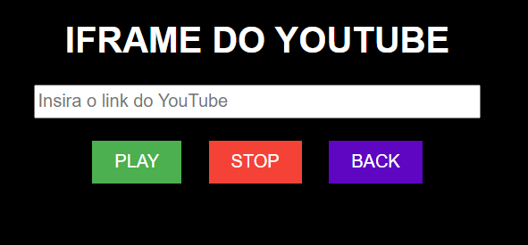
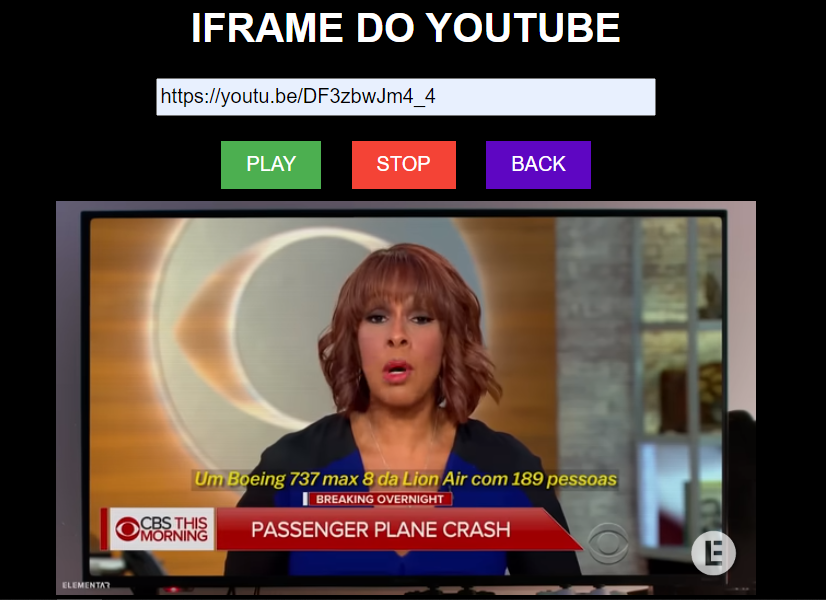

# IFRAME DO YOUTUBE VOLUME 1
🎬ASSISTA SEUS VIDEOS FAVORITOS DO YOUTUBE ATRAVÉS DO IFRAME!

 <br><br>
 <br>

## DESCRIÇÃO:
O objetivo deste aplicativo é permitir aos usuários reproduzir o áudio de vídeos do YouTube de forma rápida e conveniente. Os usuários podem inserir o link de um vídeo do YouTube na caixa de entrada fornecida e, em seguida, reproduzir o áudio do vídeo clicando no botão "PLAY". Além disso, eles têm a opção de interromper a reprodução a qualquer momento clicando no botão "STOP". O aplicativo também oferece a funcionalidade de limpar o campo de entrada após interromper a reprodução. Com essas funcionalidades simples e diretas, os usuários podem desfrutar do áudio de vídeos do YouTube de maneira eficiente. Aqui estão as principais funcionalidades implementadas:

1. **Inserir Link do YouTube:** Permite ao usuário inserir o link de um vídeo do YouTube na caixa de entrada.
  
2. **Reproduzir Áudio:** Ao clicar no botão "PLAY", o aplicativo reproduzirá o áudio do vídeo do YouTube inserido no campo de entrada.
  
3. **Parar Reprodução:** Ao clicar no botão "STOP", o aplicativo interromperá a reprodução de áudio do vídeo do YouTube.
  
4. **Limpar Campo de Entrada:** O botão "STOP" também limpará o campo de entrada e redefinirá o aplicativo para um estado inicial.

## COMO USAR?
### BAIXANDO O PROJETO:
* Clone o repositório para o seu sistema local:

```bash
git clone https://github.com/VILHALVA/IFRAME-DO-YOUTUBE-VOLUME-1.git
```

* Navegue até o diretório do projeto.

```bash
cd IFRAME-DO-YOUTUBE-VOLUME-1
```

* Descompacte o arquivo ZIP (se você baixou manualmente):

```bash
unzip IFRAME-DO-YOUTUBE-VOLUME-1.zip
```
* Abra o arquivo `CODIGO.html` em seu navegador de preferência.

### EXECUTANDO O PROJETO:
1. **Inserindo um Link do YouTube:** Insira o link completo do vídeo do YouTube na caixa de entrada. Certifique-se de que o link contenha o parâmetro de vídeo correto.

2. **Clique em PLAY:** Após inserir o link do YouTube, clique no botão "PLAY" para iniciar a reprodução do áudio do vídeo.

3. **Interrompendo a Reprodução:** Para interromper a reprodução de áudio a qualquer momento, clique no botão "STOP". Isso também limpará o campo de entrada para uma nova entrada.

4. **Atenção aos Alertas:** Se você tentar clicar nos botões "PLAY" ou "STOP" sem inserir um link do YouTube válido, um alerta será exibido solicitando que você insira um link antes de continuar. Certifique-se sempre de inserir um link válido para uma experiência de reprodução de áudio adequada.

## NÃO SABE?
- Entendemos que para manipular arquivos em `HTML`, `CSS` e outras linguagens relacionadas, é necessário possuir conhecimento nessas áreas. Para auxiliar nesse aprendizado, oferecemos cursos gratuitos disponíveis:
* [Curso de HTML e CSS](https://github.com/VILHALVA/CURSO-DE-HTML-E-CSS)
* [Curso de JavaScript](https://github.com/VILHALVA/CURSO-DE-JAVASCRIPT)
* [Confira mais cursos](https://github.com/VILHALVA?tab=repositories&q=+topic:CURSO)

## CREDITOS:
- [PROJETO CRIADO PELO VILHALVA](https://github.com/VILHALVA)
- [ESTÁ DISPONIVEL NO SITE](https://vilhalva.github.io/STYLER/STYLER.html)
